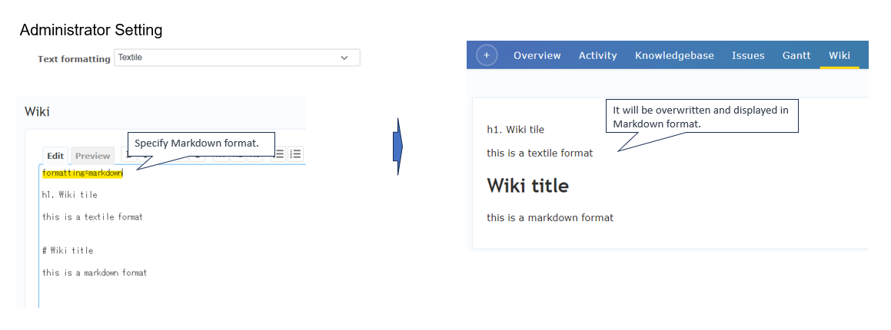

# redmine_wiki_formatting_plugin
This is a redmine plugin that allows you to change the wiki format.

## Features
* Enables to specify wiki format within the top of wiki content
* All wiki format content (Issue description)

## Usage

You can simply specify the desired format by using a designated syntax within the wiki text.
Only the first 20 characters of the syntax will be interpreted.

formatting=textile
formatting=markdown
formatting=common_mark

or

formatting=none

# Installation notes

## Install

To install this plugin, follow these steps:

1. Download the plugin.
2. Copy the plugin files to the plugins folder.
3. Restart the Redmine server.

## UnInstall

To unistall this plugin, just remove the plugin folder.